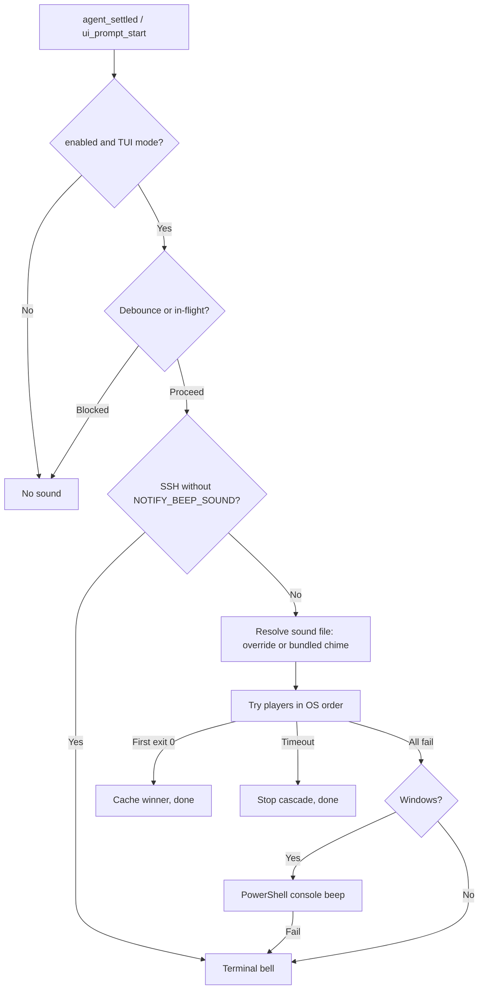
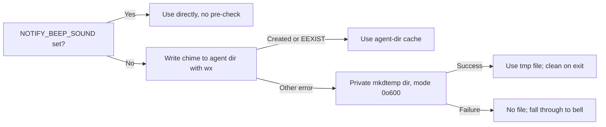

# notify-beep — Architecture

This document is the contributor guide for `pi-notify-beep`. It explains
the runtime flow, maps the code, records the reasoning behind the main
design decisions, and lists the invariants that changes must preserve.

`README.md` is the user contract: behavior, usage, and configuration.
Detailed "why" comments live next to the code they explain and remain the
source of truth for implementation specifics. This document is the map.
If it disagrees with the code, the code wins.

## Contents

- [Mental model](#mental-model)
- [Life of a beep](#life-of-a-beep)
- [Code map](#code-map)
- [Runtime lifecycle](#runtime-lifecycle)
- [Design decisions](#design-decisions)
- [Invariants](#invariants)
- [Common changes](#common-changes)
- [Glossary](#glossary)
- [Maintaining this document](#maintaining-this-document)

## Mental model

The extension subscribes to two Pi events, `agent_settled` and
`ui_prompt_start`, and plays one short chime per accepted event. The
chime is generated at runtime, cached on disk, and played by the first
working system player. If no player works, the extension writes the
terminal bell character, which is the fallback on every path. No sound
path may reject or crash the agent.

The extension is active only in TUI mode (`ctx.mode === "tui"`).

The diagram shows the decision path for a normal notification.
`/notify-beep test` skips the enabled, mode, and debounce gates, but still
respects the in-flight guard and the SSH rule.

## Life of a beep

1. Pi fires `agent_settled` or `ui_prompt_start`.
2. `maybeBeep` checks the `enabled` flag and `ctx.mode === "tui"`.
3. `beep` applies the 1.5-second debounce window, then the in-flight
   guard. A debounced or overlapping event stops here.
4. In an SSH session with no sound override, `beep` writes the terminal
   bell and stops.
5. `soundFile` resolves the file to play: `NOTIFY_BEEP_SOUND` when set,
   otherwise the cached chime.
6. `orderedPlayers` returns the OS player list with the most recent
   winning player moved to the front.
7. `playWith` runs one player at a time. The first player to exit with
   code 0 wins, and its command string is stored in `cachedCmd`.
8. If every player fails, `powershellBeep` runs on Windows only.
9. If no path produced sound, `bell()` writes the terminal bell
   character.
10. The `finally` block clears `isPlaying` so the next beep can run.

## Code map

`index.ts` is written in this order:

| Section | Contents |
| --- | --- |
| Constants | `STATE_FILE`, `CHIME_FILE` |
| SSH detection | `isSshSession`, `hasSoundOverride` |
| Config | `statePath`, `loadConfig`, `saveEnabled` |
| Players and bell | `PLAYERS_BY_OS`, `basePlayers`, `bell` |
| Playback | `playCmd`, `playWith`, `powershellBeep` |
| Extension factory | per-instance state, `bundledSoundFile`, `soundFile`, `orderedPlayers`, `ensureChimeSync`, `beep` |
| Pi wiring | `session_start`, `agent_settled`, `ui_prompt_start`, `/notify-beep` command |

`chime.ts` generates the WAV data. It exports `CHIME_SR` (sample rate),
`CHIME_LEN` (expected byte length), and `renderChime()`.

## Runtime lifecycle

### `session_start`

- Reads config once with `loadConfig`. A missing file means enabled.
- On a corrupt file, saves the default (`{"enabled": true}`) and then
  warns through `ctx.ui.notify`. A failed save produces a second warning.
- Warms the chime cache with `ensureChimeSync` unless the session is SSH
  with no sound override.
- Config is read only here. External edits take effect in a new session.

### `agent_settled` and `ui_prompt_start`

- Both call `maybeBeep`, so both share the same gates: enabled and TUI
  mode.
- Accepted events call `beep()` and are not awaited (fire-and-forget).

### `/notify-beep`

- Arguments: `on`, `off`, `toggle`, `status`, `test`, or empty (toggle).
- `on`, `off`, and `toggle` update `enabled`, persist with `saveEnabled`,
  and warn when persistence fails.
- `status` only reports the current value.
- `test` calls `beep({ force: true })`. It ignores the enabled flag, TUI
  mode, and debounce, and it does not update `lastBeep`, so it cannot
  consume the next real notification. It still respects the in-flight
  guard and the SSH rule.

## Design decisions

### D1. Fail open, never crash the agent

**Decision.** Every failure path ends in sound or silence, never in a
rejected promise or a thrown error.

**Why.** A notification is optional; crashing or blocking the agent is
not acceptable. `playCmd` resolves a result instead of rejecting, `beep`
catches all errors and falls through to `bell()`, and `bell()` is wrapped
so a closed stderr cannot crash the agent. `saveEnabled` returns `false`
on failure and callers notify the user.

**Trade-off.** Failures are quiet; diagnosing them requires reading the
code comments or adding temporary logging.

### D2. No IO at factory time

**Decision.** The extension factory only initializes state. Config is
read at `session_start`.

**Why.** The factory runs during Pi startup, before a session exists, and
IO there can delay or break startup. `session_start` is the single source
of truth for config. All mutable state (`enabled`, `lastBeep`,
`bundledCache`, `cachedCmd`, `isPlaying`) is per instance, so a reload
starts clean.

**Trade-off.** Config is read once per session. External edits apply to
the next session.

### D3. Player selection per OS

**Decision.** File players are tried in a fixed per-OS order. The first
player that exits 0 is cached by command string and tried first next
time.

| Platform | Try order |
| --- | --- |
| Linux, BSDs, other Unix | `pw-play` → `paplay` → `aplay` → `mpv` |
| macOS | `afplay` → `mpv` |
| Windows | `mpv.exe`, then `pwsh` → `powershell`, then bell |

**Why.** Missing binaries fail in about a millisecond, but skipping
irrelevant spawns reduces first-beep latency and process noise.
`mpv.exe` is explicit on Windows, where PATHEXT resolution is not
reliable; `mpv` remains Unix-only. Platform policy lives in
`isWindows()` and `basePlayers()`, so no other code needs
`process.platform` checks. Tables are frozen, and the winner cache is
keyed by command string rather than object identity, so entries may be
inlined.

**Trade-off.** The cache lives for the session. After a `PATH` change, a
previously working player is tried first and then falls through.

### D4. Spawn results and timeouts

**Decision.** `playCmd` resolves `ok` (exit 0), `fail` (spawn error or
non-zero exit), or `timeout` (killed after 2 seconds).

**Why.** A missing binary reports asynchronously through the `error`
event (typically `ENOENT`), not as a synchronous throw, so `spawn` needs
no `try/catch`. A player that is installed but broken (for example,
`pw-play` with PipeWire stopped) exits non-zero, so close codes must be
watched; the `error` event alone is not enough. The chime is 0.32
seconds, so a player still running after 2 seconds is treated as handled
and the cascade stops. A timeout is not cached as a winner, so a long
custom file does not permanently change selection. `child.kill` can
throw if the process exits first, so it is guarded, and the timer and
child are `unref`'d to keep playback off the event loop.

**Trade-off.** A custom sound longer than 2 seconds is cut off.

### D5. Sound override without pre-checks

**Decision.** `NOTIFY_BEEP_SOUND` is passed to players directly, without
an `existsSync` validation.

**Why.** Checking a path before using it leaves a TOCTOU window: the
file can disappear or change between the check and the spawn. Spawn exit
codes are authoritative. A bad path fails once per player, which is
fast, and then the terminal bell is used.

**Trade-off.** A typo produces one failed spawn per player per
notification, with no early warning.

### D6. SSH sessions use the bell

**Decision.** When any of `SSH_CLIENT`, `SSH_TTY`, or `SSH_CONNECTION`
is set and no sound override exists, `beep` writes the terminal bell
instead of playing a file, and `session_start` skips the cache warmup.

**Why.** A remote player that exits 0 would suppress the bell that does
reach the local terminal; the bell is plain bytes on the SSH stream.
Skipping the warmup avoids writing a cache file on the remote host.

**Accepted behaviors.** `NOTIFY_BEEP_SOUND` bypasses the SSH rule because
the user has opted into audio forwarding or a local file. The override
is read at call time, so exporting it mid-session works and the cache is
created lazily. `/notify-beep test` follows the same SSH rule so it
demonstrates real notification behavior.

### D7. Chime caching and tmp fallback

**Decision.** The primary cache is `<agent dir>/notify-beep-chime.wav`,
created with the `wx` flag (O_EXCL). If that fails for a reason other
than `EEXIST`, a private `mkdtemp` directory under the system temp dir
is used instead.

**Why.** `wx` makes creation authoritative: either this process created
the file or it already existed, so there is no check-then-write race.
`EEXIST` means a previous run created the cache and it is reused as-is;
a corrupt cache only fails playback and falls back to the bell. The
agent directory respects a custom agent-dir setting, and the extension
source directory is never written to. The tmp fallback uses `mkdtemp`
with a fixed inner filename and mode `0o600`, because a predictable name
such as `pi-beep-<pid>.wav` could be pre-created by another user as a
symlink. The extension never unlinks a file on `EEXIST`, since it must
not delete a file it did not create. The tmp directory is removed
best-effort on process exit.

Reloading while the process stays alive leaks one tmp directory per
reload until exit. This is accepted to avoid tracking state across
reloads in a module global.

**Warmup.** `ensureChimeSync` writes the chime once at `session_start`.
The file is 14 KB, the write is one syscall, and generation costs a few
thousand `sin()` calls (about 0.5 ms), so a synchronous warmup is
simpler than an async warmup with a join state machine.

### D8. Config parsing and persistence

**Decision.** `<agent dir>/notify-beep.json` is read as
`{"enabled": boolean}` and parsed once at `session_start`. Saves are
atomic.

**Parsing rules.** A missing file means enabled and is the normal
first-run state, not corruption. Bad JSON, a non-object, an array, or a
non-boolean `enabled` is corrupt: the file is healed to
`{"enabled": true}` at `session_start` with a warning. An absent
`enabled` key means enabled and is not corruption.

**Why.** The file is read directly instead of stat-then-read, which
would add a TOCTOU window; `ENOENT` means "no config yet" and other IO
errors fail open. Parsing is pure: it never writes, warns, or notifies.
Saves write a temporary file and rename it, so a crash cannot leave a
half-written file. Persistence errors never crash the agent, and callers
warn so the UI does not report a state that will not survive a restart.
The file is created only by `on`, `off`, `toggle`, or corrupt-config
healing; `status` and a normal session start do not create it.

### D9. Chime generation

**Decision.** `renderChime()` generates a two-tone `G4 → C5` chime as a
22050 Hz mono 16-bit PCM WAV, 14156 bytes (0.32 seconds).

**Why.** Generating at runtime avoids a binary asset in the repository.
Samples use explicit `writeInt16LE` calls, which produce identical bytes
on little-endian and big-endian hosts and avoid native-endian `Buffer`
aliasing; do not replace this with a bulk native-endian copy without a
big-endian fallback. There is no SHA pin: a 1-LSB `Math.sin` drift
across V8 versions is inaudible, while structural checks (valid RIFF/WAVE
header, expected frame count, peak range) catch real breakage without
locking bytes.

**Trade-off.** First use in a session pays generation and write cost
(about 0.5 ms).

### D10. Concurrency control

**Decision.** Playback is protected by a 1.5-second debounce
(`DEBOUNCE_MS`), an in-flight guard (`isPlaying`), and a 2-second
per-player timeout (`PLAY_TIMEOUT_MS`). The test command can bypass the
debounce.

**Why.** `agent_settled` and `ui_prompt_start` can arrive back to back,
so the debounce makes them share one chime. Playback chains can overlap,
so the in-flight guard drops overlapping beeps instead of stacking them.
`force` (used by `/notify-beep test`) bypasses the debounce and does not
update `lastBeep`, so a test cannot consume the next real notification.

**Trade-off.** A real notification within 1.5 seconds of the previous
one is intentionally dropped.

## Invariants

Changes must preserve these rules. Each exists for a reason documented
in the decisions above.

1. No code path may reject a promise or throw into Pi. Catch errors and
   fall through to the bell.
2. Do not perform IO during extension factory execution. Read config in
   `session_start`.
3. Do not check a file and then act on it (`existsSync` followed by
   read/write/spawn). Use a direct operation and handle errno values.
4. Create caches with `wx`. On `EEXIST`, reuse. Never delete or overwrite
   a file this extension did not create.
5. Keep platform decisions in `isWindows()` and `basePlayers()`. Do not
   scatter `process.platform` checks.
6. Keep all mutable state inside the extension factory. Do not add
   module-level globals; reloads must start clean.
7. Keep `PLAYERS_BY_OS` entries frozen and key the winner cache by
   command string.
8. Do not hash-lock the chime. Assert header, frame count, and peak
   properties instead.
9. Keep explicit little-endian sample writes unless a big-endian path is
   added at the same time.
10. Keep playback fire-and-forget: `unref` the child process and timers.

## Common changes

### Add or reorder a file player

1. Edit `PLAYERS_BY_OS` in `index.ts` and keep the entries frozen.
2. Use `mpv.exe` for Windows entries and `mpv` for Unix entries.
3. Update the player table here and the "Sound" list in `README.md`.

### Add a config key

1. Extend `loadConfig` with a default and explicit corruption rules.
2. Extend `saveEnabled` (or add a sibling) and keep writes atomic.
3. Update the "Config" section in `README.md` and this document.
4. Keep persistence failures non-fatal and warn through `ctx.ui.notify`.

### Change the chime

1. Edit the synthesis constants in `chime.ts`.
2. Update `CHIME_LEN` if the length changes.
3. Keep structural assertions (header, frames, peak) instead of a hash.
4. Update the "Sound" section in `README.md` if tones change audibly.

### Add a trigger event

1. Subscribe with `pi.on(...)` in the factory.
2. Route it through `maybeBeep` so the enabled and TUI gates apply.
3. Update the lifecycle and code map sections here, and `README.md` if
   the user-visible behavior changes. Check the debounce interaction.

### Add an environment override

1. Read the variable at call time, not at import time, so a late export
   works.
2. Document it in `README.md` and this document.
3. Keep the behavior fail-open; an unset or empty value must fall back
   to the default path.

## Glossary

| Term | Meaning |
| --- | --- |
| Agent dir | Pi's per-user configuration directory from `getAgentDir()`. |
| Bell | Terminal bell character `U+0007` on stderr; the final fallback. |
| Debounce | Ignoring events within 1.5 seconds of the last accepted beep. |
| EEXIST / ENOENT | Node errno codes: path exists / path does not exist. |
| Fail open | On error, choose the permissive behavior (play, bell, enabled). |
| In-flight | A beep chain that is running; overlapping beeps are dropped. |
| O_EXCL (`wx`) | Creation flag that fails if the file exists. |
| RIFF / WAVE PCM | The container and codec of the generated chime. |
| SIGKILL | Uncatchable kill signal, used to cap playback at 2 seconds. |
| TOCTOU | Time-of-check/time-of-use: a race between checking and acting. |
| TUI mode | `ctx.mode === "tui"`; the only mode the extension notifies in. |
| `unref` | Node method that keeps a handle from holding the process open. |

## Maintaining this document

- Reference function names, not line numbers; line numbers drift.
- Behavior changes update `README.md`. Why/how changes update this
  document and the relevant code comment in the same commit.
- Keep the Mermaid diagrams valid. GitHub renders them; preview changes
  with a Mermaid renderer or validate them with Mermaid's parser.
- Keep the mental model and code map current when modules are added.
